# Journal 

## January 23 2024 - Morning
I want to start my first case using a framework I already know (sort of) well, the physics engine matter.js. I've used it a lot in the past, So I think I want to start by listing and brainstorming freely about things I know about it and would want to push further, as well as what could be interesting in combination with other frameworks for visualizing the actual physics. 

## January 23 2024 - Afternoon

So I made a list of things I think are interesting to play with using matter.js that I would like to explore based on the [demo](https://brm.io/matter-js/demo/#cloth) page.

### Technical details 
1. Cloth simulation - I've always had the idea of hiding something under it
2. Complex SVG concave shapes (complex physical typography or drawings)
3. Compound bodies of complex shapes - recreating a human doll for example
4. Spring constraints - simple but never tried
5. Soft body - squishy things
6. Complex terrain 
   
## January 24 2024 - Morning

I woke up a bit confused this morning about a bunch of stuff. 
1. What I want to make, is it weird web design, games, interactive art, experience... Should I even chose... I think its a web interactive experience game-like thing that incorporate weird web design things that could be used in weird web design?
2. How I should proceed in choosing a theory for each framework
3. Should I start by making small things or brainstorming big things
4. Should I experiment a bit with every theory so see what fits best with each framework? 

I started reading about humour and comedy this morning. I was looking for a sort of overview of the history and different theories that were out there. I decided to read the [philosophy of humor](https://plato.stanford.edu/entries/humor/) article from the Stanford Encyclopedia of Philosophy to introduce myself to everything. Here are some notes I took :

- Humour is an important part of the human experience but is neglected by philosophers
- Before the 20th century, laughter in philosophy was often negatively associated, condemned, intepreted as a loss of self-control, sometimes even ungodly, malicious, morally objectionable... 
- Plato never laughed (haha)
- This negative approach to laughter and humour led to the **Superiority Theory**, where laughter expresses a feeling of superiority when comparing ourselves to someone else, or a former version of ourself
- **Thomas Hobbes**, english philosopher: "Laughter is nothing else but sudden glory arising from some sudden conception of some eminency in ourselves, by comparison with the infirmity of others, or with our own formerly." [About Hobes](https://jonathansandling.com/thomas-hobbes-on-humour-and-laughter/)
- Superiority Theory was criticized and weakened during the 18th century because of the avent of the **Relief Theory** & the **Incongruity Theory**
- Relief Theory: first accounts were related to a scientific explanation where the nervous system released imprisoned "animal spirits" in reaction to humour (Earl of Shaftesbury)[https://www.earlymoderntexts.com/assets/pdfs/shaftesbury1709a_1.pdf]
- Arendt also was into relief theory, relief from pain, where she allegedly forced herself to laugh "uncontrollably" (??) when writing *Eichmann in Jerusalem* (link)[https://www.abc.net.au/religion/the-laughter-of-hannah-arendt/13401584]
- Taking someone on a dark journey and then flipping it to discharge the energy in the end (Herbert Spencer)
- Sigmund Freud also wrote about it, where laughter also releases nervous energy (usually sexual or hostile)
- This theory is also very "debunked" today in regards to humour as process of releasing pent-up energy, questionable theory
- **Incongruity Theory**: also arose in the 18th centyry to challenge the Superiority Theory, is based on the perception of something incongruous - something violating mental patterns or expectations. Is now the dominant theory in philosophy and physchology (James Beattie, Immanuel Kant, Arthur Schopenhauer, Søren Kierkegaard...)

SO YEAH.

## January 26 2024 - Afternoon
*Transcribed from vocal note using Otter.ai*

This is my first entry transcribed from vocal note and edited to make a bit more sense. I'm trying this way of doing instead of traditional writing journaling because talking feels more productive and freeing than writing. Recording allows me to later transcribe and edit, focusing on the essence. Writing gets me too caught up in words and structure.

Currently, I'm experimenting with the "This Person Doesn't Exist" API to generate fictional faces. I then create Matter.js bodies for each pixel of the AI generated face, exploring the intersection of random faces and pixel particles. I don't know why I'm doing this. It's a technical start, aligning with my desire to infuse humor theory into programming I guess. Or just doing something to overcome the blank page syndrome. 

I've read a bit into humor theories literature, focusing on superiority theory for my first case (chronologically, it is sort of the first official theory, so it makes sense to start the creative journey with it as well). The challenge is integrating humor theory seamlessly into my work, not just discussing it. My approach involves small technical explorations with Matter.js, infusing them with superiority theory.

For example, using friction in Matter.js, and finding ways to create humor based on superiority theory using this specific element to create a small sketch. The goal is to have around 10 such explorations per theory, eventually leading to a more significant project with a narrative aspect or a more developped conceptual approach. Each case will have a list of sources from various authors discussing the chosen humor theory. This week, I'll compile resources on superiority theory to deepen my understanding.

SO. This semester, Matter.js is my main framework, with a focus on physics and the integration of superiority theory. Other frameworks may come into play, but the primary emphasis is on the chosen theory and physics in Matter.js.

## February 6th 2024 - NOON

Hello,
I'm feeling so good because my porftolio using matter.js got featured on a nice website that feature weird websites. This got me excited and then I posted my pixelated faces experiment on instagram because I was excited, and then when I was writing my little caption I wrote : 

"Currently obsessed with printing pixelated people that don’t exist using the @peoplethatdontexist API

I don’t know why this is so satisfying and weird to me. Feels like I’m digitally birthing these people."

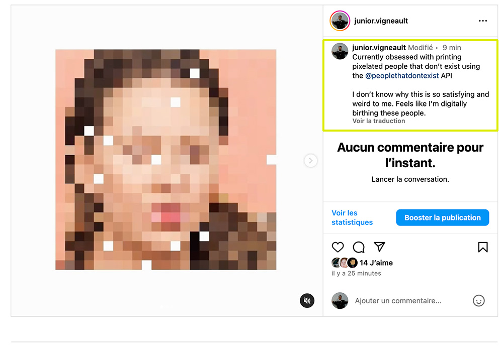

This made me realize two things:
1. I only get ideas when I'm happy
2. I think I care too much what people think about me

But anyway, the idea behind printing people that don't exist was inspired by Darius Kazemi's [Make Someone](https://tinysubversions.com/stuff/person/) where you generate a new AI person by clicking on a button, and then this person is associated with three random characteristics (that can contradict each other, making it even funnier imo). This makes me think about the superiority theory in a way where I feel the humor is coming from feeling superior to the person I'm creating. I feel like they are ridiculous, especially with these random values and beliefs. There is something funny in the fact that they are not consenting to being created even, and given a personality at random. We laugh at them, activating the superiority theory (I FEEL LIKE). I'm still looking for good literature about the theories, but I'm noticing that OF COURSE they are sort of mixed together. Like there is definitely incongruity theory in here.

I was trying to think about examples of things I find funny related to superiority theory, and I thought about something I did that was kind of mean in CEGEP. So there was this girl from my high school that claimed to be a photographer but her pictures were horrendous really. She had a Facebook page with all her photographs, and one day she posted an album with really awful photos of a bunch of girls (also from my high school) going for a night out. The pictures were taken in a weird basement with bad lighting, and the girls all had their cute outfits with tiaras, yes, *tiaras*. There was a bunch of different absurdly normal photographic dispositions with different girls sitting, standing, and crouching in different areas of the basement, and the last shots were in front of a limousine parked on the street, which they had rented for going out on a Saturday (???).

Needless to say, my mean friends and I thought this was completely hilarious and these pictures became a sort of golden grail of artistic ideas. At the time as students, when applying for a student credit card, we could choos a photo that would be a background for our credit cards, and I very excitedly decided to take one of them as my credit card picture. Then my friend made a crew-neck featuring 2 other pictures that I got for my birthday, and I think we even did a mouse pad at one point. We were thinking of making a whole collection of items featuring these pictures basically. Even though they knew nothing about that (I think?), this was obviously mean, and now I kind of feel bad about it, but I still think it is hilarious and inspiring. We became genuinely obsessed with these pictures, so much that we started to love them for their aesthetic and really, they became art in our eyes, which is maybe even more mean, but I don't know, the line became blurry at some point.

All that to say that I think I want to take inspiration from this to work on my first case. And working with the pixelated faces, and writing about giving **digital birth** to them (project title idea????????), I thought I could maybe create something where you have to give birth to an AI-generated person that grows and gets older, an experience where you are the parent of this person. I think parents probably laugh at their children and feel superior??? Maybe. I also thought about being a teacher and teaching a classroom with AI faces and laughing at them. Exploiting a sort of power dynamics for LAUGHS. Like a kindergarten class could be funny. Or mayby not trying to recreate something like an environment, just a page where an person that doesn't exist needs to be taken care of. I think since they are AI people, then feelings don't really get involved, and that leaves a lot of space for comedy. GOOD TALK.

## February 29 2024 - NOON
*Transcribed from vocal note using Otter.ai, I think it's a bit weird so not sure i'll continue doing that*

 So in my interdisciplinarity class we have this teams project where we have to exchange one aspect of our discipline with another designer. And the designer that I'm working with is someone who does site specific work. Usually with sort of abandoned sites where the nature is left to grow and there's also people using it it's not specifically for something it's just like sort of there and wild and free. And so they (the designer) usually go there and explore this site and take like different documentation different things using natural resources and playing with those things, to sort of reconnect with the land and understand you know, what's happening with this and so yeah, so anyways, I don't even really understand it too much. But I sort of took from *that* just going outside and documenting (haha), going somewhere specifically and then documenting this using video pictures and other and I also did a sketch. also recorded sounds with sound recorder. I'm sure I was trying to do something. Like trying to see what I can do with JavaScript to make something out of all that documentation. And for this small project, and I had this idea of just taking birds, video of birds and using media pipe to sort of detect the bird and then use this image in a video of a bird to sort of take it out of its context and put it in a different context. And this came from the idea that we're, their superiority theory and humor is about laughing at something and I think that when we're putting animals in other contexts, in different contexts, it's we make them sort of ridicule and we laugh at them, in a sense and I think this relates a lot to the superiority theory because we're we're like we're feeling superior to the bird that we're putting in a different context and I sense and you know, birds are just they have like these they're already funny munificence by themselves, but like so yeah. So I had the idea of like using media pipe to object detection to really sort of cash in on the idea of like, detecting something and then pulling it out of its context and then putting it into another context. So like, for example, you could detect a bird using your phone and then this would like capture a picture of the bird, cut out the actual bird and then transfer it into like, I don't know, put a hat on it and, and stuff like that. So I'm going to work on start working on that. And I know I was I said, I was working with Metro js and I'm a bit over it, to be honest at this point. Like, I'm gonna probably go back to it at some point, but now I'm really excited to actually work on this small idea that I have. So yeah, I'm going to try to do that. So right now I'm really concentrating on actually it's been really a pain in the neck to connect media pipe with P five, because I don't know I like to work with P five for visual stuff. So yeah, right now I'm just focusing on that. But we will report later. Thank you.

## April 5 2024 - AFTERNOON
 ****CRACKS KNUCKLES**** *
OK. So i've been making a bunch of experiments with object detection from mediapipe (and a bit of segmentation but was a bit too laggy). I've been using bird footage as input since my ontology exchange from my last project in interdisciplinary design. I like birds, i think their movement is interesting and they have a sort of innocence that is interesting for working with humour. They are clueless. They also produce the unpredictable data I'm looking for. I ususally work with my own input through video like face or hands or whatever and i wanted something more spontaneous and unpredictable. I'm also interested in using animals to create humour. Anyways, that's not what I want to think about and I think I already talked about that earlier.
I want to break down here the things i did in the past month and all the ideas i had.

The first thing I was basing myself off is the superiority humour theory to explore birds and object detection. I decided on this trio for two reasons. 
The first:
1. Because of John morreals explanation on the theory, where he states that the ridiculous, more specifically, the self-ignorance of others when they falsely believe that they posess wisdom. I think that with machine learning, there is this sort of belief that it is intelligent because it is making decisions on its own. And while it is impressive and "intelligent" in a way, there is still ways in which these decisions don't make sense and fail. But they still make these decisions "confidently" which makes them self-ignorant and "falsely believe that they posess wisdom". This then becomes a really good source of humour because it doesn't know that it's being "studid", but we know because we are seeing it. I think this happens because it *does* make decisions that are *intelligent* sometimes, but it's not realizing when the decisions don't make sense and since we are expecting intelligent decisions then we laugh at it's misfortune or failure. 
2. I chose to examine living things with mediapipe, specifically birds, with superiority, because of the anthopocentrism theory, where humans are at the center of everything and the most important entity on the planet and superior to nature. I feel like we can laugh at animals because of a feeling of superiority to them, at least until it hurts them physically or emotionally. This also relates to the superiority where for example, if you distort put a costume on a dog, it becomes ridiculous and it becomes "unaware" of its own misfortune so it provokes humour from a superiority pov. I mean we laugh *at* them directly in contrast of with them, because they 1 cant laugh and 2 don't know what is even happening. There needs to be a sort of separation between both parties in order for it to be humour from superiority i feel. Like if it were a human with a costume, they would know the situation they are in and probably laugh with us because 1 they put the costume on themselves (probably) and they are aware of the situation. Then i feel like it drifts away from the feeling of superiority. So thats why i chose animals, specifically birds, because of their ignorance and their fragility, making them really good targets for superiority. 

SO. love a good so to start off a journal paragraph. SO.

The first thing I thought could be funny is to try to detect birds! What is a bird and what is not a bird. Hey MediaPipe, show us what you think is a bird since you're so intelligent!!! So my original plan was to use video footage of birds flying as input for the object detection, then when pressing on a button, the video stops and the bounding box of the first detection is copied (the pixels inside the bounding box), then segmented using mediapipe image segmentation, and pasted on the canvas. My plan was to start making something similar to Darius Kazemi's Make Someone, where random characteristics are given to an AI generated portrait of a person. I thought: That could be hilarious if people could open a webpage on their phone, point their phone camera at a random bird, have that bird detected, then by clicking a button if there is a detection, the bird is segmented and random AI generated bird-like characteristics are given to that bird. Example:
- Name: Feather McFlap
- Occupation: Doctor at Beakington Hospital
- Favorite Quote: "Be yourself; everyone else is already taken." - Oscar Wilde

Then this bird would be added to the user's library of birds, joining a catalog of previously identified birds. Now that I'm writing this I'm like wow this is really good i should spend more time making this haha because yes spoiler I did not make this. I actually stopped because the segmentation was a bit weird, and not precise, sometimes just giving a couple pixels of the bird. This was a failure that was NOT funny. And I think that it was not funny because what I was doing was programming a digital interactive joke, where timing and every little piece was reliant on the next to create the humour in the end. So when this is happening, then everything needs to *work* so that my comedic intentions succeed. So yeah, I'm starting to make a difference between programming actual jokes with a precise narrative were I need the tools i'm using to work in the way I intend them to work and programming an environment where humour can arise on its own from unpredictable behaviour. I think the second one feels stronger?? At least in the way I'm building this research. The first one feels very subjective in a way where I am the comedian programming this joke, i'm more exploring the art of making interactive commedy from my perspective as a digital comedian (???) (why am i on FIRE literally right now I feel like i'm emptying my entire brain here) WHEREAS the second option is more about how the js frameworks themselves can deliver on comedy. 

SO. 

Let me walk myself through the experiments that led to all that brain dump.

Experiment 1 -
Object detection on live video feed of birds holding mouse click down, and when pressing "S" key, a new image is then created from the pixels in the bounding box of the detection. Then this new image is segmented and displayed on a white background. This is what I would have used to then write the generated characteristics.

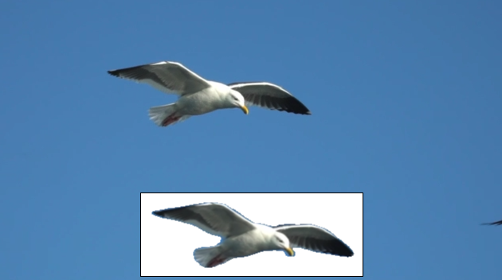

I think maybe I worked too long on this but kind of lost its touch a bit. The tough thing about case 1 (programing an elaborate interactive joke), is that you have to sort of trust the process because as some point you don't laugh yourself anymore. You're just building this thing that hopefully will be funny in the end because of your initial idea. Also, in the context of this project where I needed to take a risk and experiment with stuff, this felt a bit too much like "I have an idea and I'm going to just make it" instead of "lets try to experiment with this and that and see what happens?". Like i'm closing myself options and new things. Like maybe the comedian route is not even research-creation at all in a sense. I guess it's more just... creation? Also, the segmentation here works well because it is one bird on a perfect blue sky in slow motion, but in a more complex context it just didnt work too well. Like event this still really good footage produces weird results:

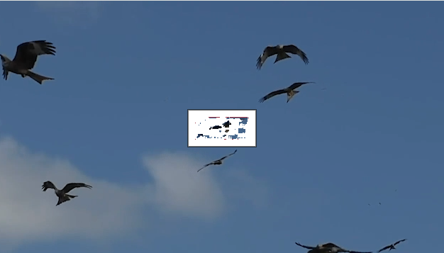

SO yeah I also tried with my own footage and it was really not working well (the goal being to develop this platform where people can document their own birds with footage not perfect). This comes back to the idea of having something *WORKING* or not *WORKING*. I think I have to make things that are not working FIRST to see how humour emerges from that and then maybe that would eventually lead to be able to make something that is WORKING? I guess that is literally my research. So I guess i'm just stating really obvious things at this point.

From there I decided to scrap segmentation and work with detections only. My new goal: be able to just copy the pixels inside the bouding boxes of each detection and past that on a second canvas. Groundbreaking. I started to think a bit and got an idea where I could create this sort of cartography of birds leaving trails behind. Like the birds would draw on the canvas based on their position basically.

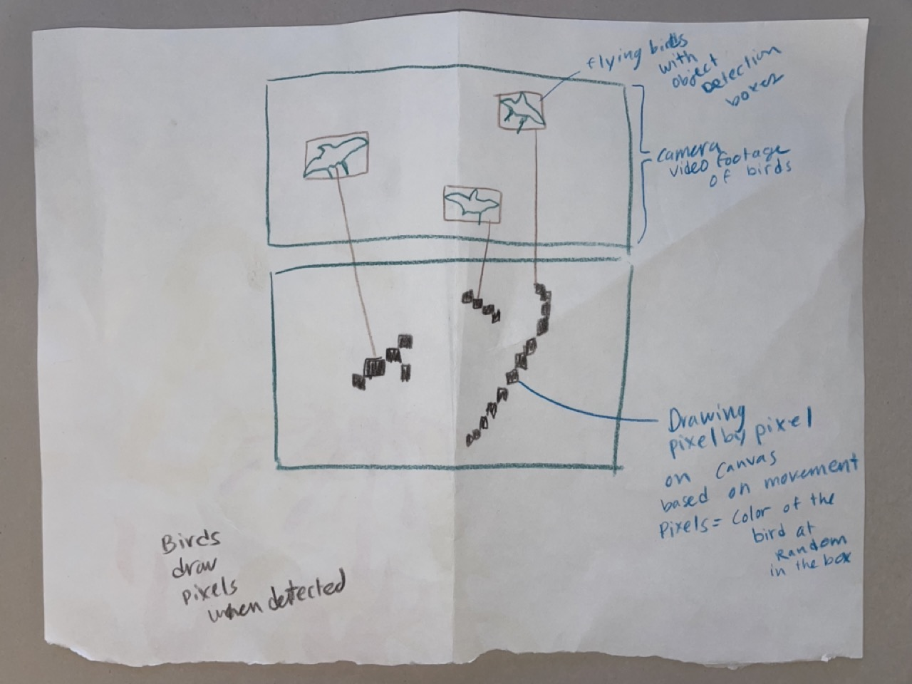

 So yeah not funny at all and not even humour related. I just wanted to make that IMMEDIATELY for some reason. So I took about three weeks of valuable time to make that thing. And it looks NICE (really). It went into several transformations, like i decided to copy the entire bird image instead of pixels. It was just more visually interesting. At first all the bird images were just a top one another.

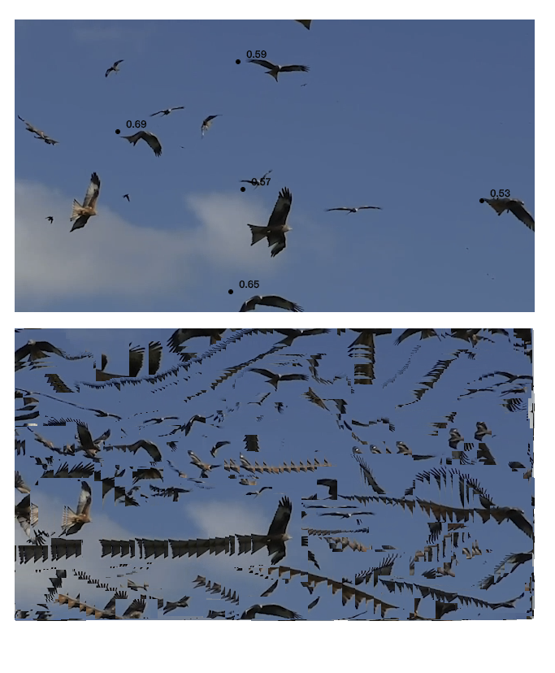

It was nice to see the pile up, but I kind of enjoyed also seeing the background at the beginning and then seeing the trails cover the background. So I decided to keep the trails but have them dissappear when there is more than 100 or so. I started to look very brutalist aesthetically and so I looked up work of brutalist graphic design on pinterest and decided to put the background red to for contrast. So I ended up with a sort of generative graphic design-ish thing. I don't really know what this says or is. I think its a cool experiment. 

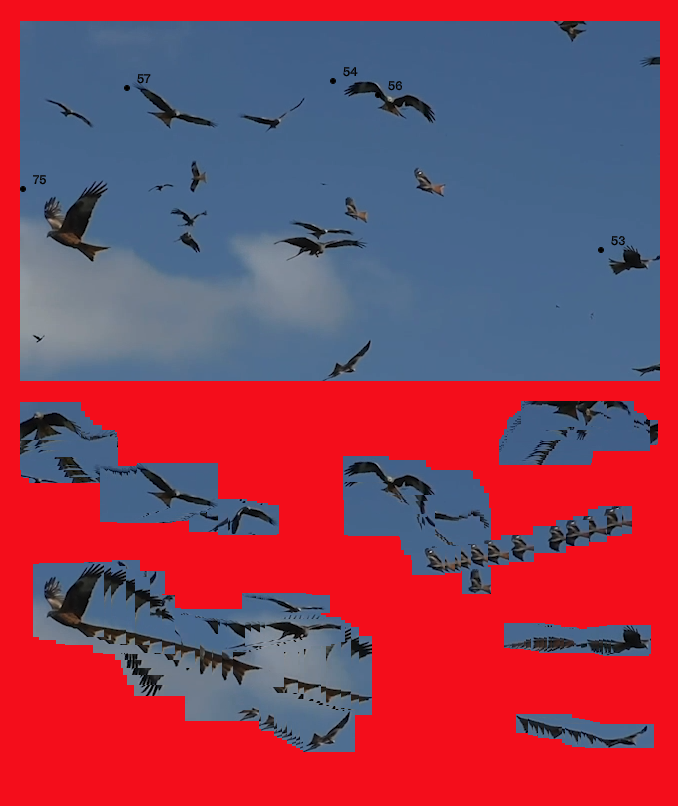

But it did send me on a sort of interesting tangeant about my thesis : am I interested in looking at what happens when designing things informed by humour theory - and not trying to make them funny necessarily - or to look at how to make funny things using humour theory. Do the things I make have to be funny in the end? I don't really want to have to measure any of that. The idea of this experiment was born because I used humour theory to experiment with stuff before that. In the end my thoughts on this is that I should try to push the humour theory to the max if I want to make my research worthwhile, even if the output is not LOL funny. I think this experiment did not push the humour theory enough to be considered part of the whole thing. But still was interesting to think about the output this way. 

At this point I felt a bit lost. Reminder: I have to present a fully finished project by the end of the semester, and It didn't feel right to present the trail experiment because it felt a bit disconnected from my research and shallow conceptually EVEN though it is really beautiful and i could look at it for hours (no joke). I brainstormed a bit and came back to an idea I had earlier in the process which I DID NOT mention before this. Inline with my ontology exhange, I was thinking about using the spontaneity of the living to manipulate things in the browser. I could use the position of the birds to move windows or do specific things inside the browser for example. I was thinking this would probably relate more to the incongruity theory though. But at this point in the assignment I understood that I should not limit myself to my own thesis and was encouraged to make something a bit out there that was not necessarily 100% about the themese i'm looking at in my thesis. I'm still trying to make this idea come to life so more on that at 11. 

BUT. (big journal entry today)

I did also do something else that I want to touch on. So while I was trying to implement that birds would appear in pop up windows, i started programming and ran my code on a live server. I made a mistake in my code and suddenly, for every frame of every bird detected in the video, a pop up started to open with an image of the the bird. My computer was out of control as literally thousands of pop ups were opening. Three things happened: 
1. My computer was not responding so i had to manually reset it BUT before -
2. It made me laugh, the amount of popus oppening was kind of hilarious. So again, breaking things is funny i guess.
3. The images in each of the pop up were really funny because there were all the same size, so birds started to be distorted to fit the size of each popup.

I was able to take a screenshot of a couple of these popups for reference before my computer was completely unresponsive. I chose 9 of these popups that I thought were funny and asked myself why they were (funny).

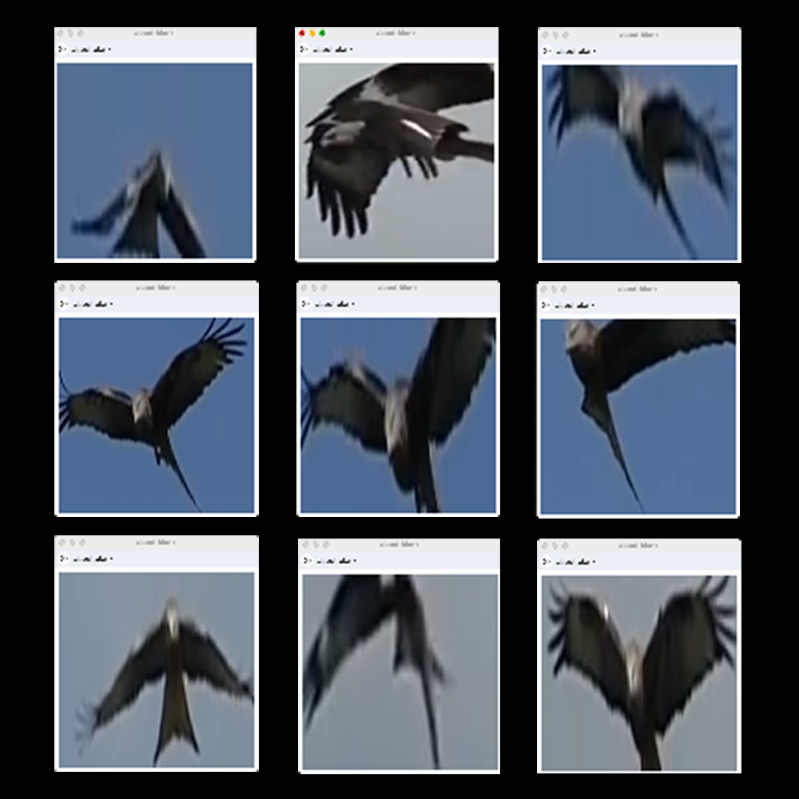

Then I realized that the deformation of the birds by the size of the browser window was making them really funny and gave them more of a personality or intention? Also the fact that it is a random frame taken puts the spotlight at a precise moment where they could be funny. Not all were funny in the batch of around 50 I managed to screenshot, but those were. So I figured this: When detecting a bird, a living thing, and randomly stopping on a frame of the detection with a slight distortion, then *THERE IS A CHANCE* that it becomes humorous. Also, the tension of waiting to land on something funny builds and makes the REAL FUNNY one even more funny. So while I was stuck in my popup idea (the code was not working and I needed help), I decided to work on another version of the map bird, and to create a sort of point of focus on the detections with a specific width and height. Like a lens to isolate specific moments of the detection. I'm not 100% sure of where I want to go with this, but I'm thinking that if I accentuate the intention of the birds with sound, I could be having something really interesting. I'm thinking that I could have a bunch of short samples of music that would accompany the bird detections and sort of frame the personality of the bird that is highlighted even more? So everytime it jumps to a different bird, it would trigger a different sample. Sometimes it would be funny and sometimes not I'm guessing. But yeah following what I learned from the pop up failure, I feel like isolating the birds with a bit of distortion and accompanying that with a random characteristic to make them into something they are unaware, to give them a personality without consent in a sense, would make them ridiculous and would trigger the superiotity theory. So for now I have this but thinking of pushing this further (i wish i could put gifs in here....)

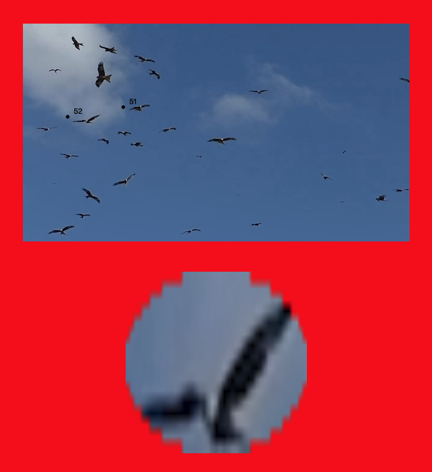

So the circle would be the lens through which the birds are being seen through. 

WOAH. Good talk.

## March 23 2024 - MORNING

So. Instead of making tests to see where I wanted to go with this, I decided to sprint with the idea I wrote about previously, clicking on a bird to isolate it and zoom in as a sort of private lens and then use a random sample of music to accompany it, putting it in a sort of context, isolating it and giving it an intention separate from its original context (incongruity theory??). I decided to sprint because I had a week and a half left before presenting a finished and sophisticated and debugged artifact in front of my peers and faculty in my class. It was nice to really go for it, but I think I got a bit of conversation with my materials lost in the shuffle. Basically I need to be a bit more consistent with my MDM, It was a bit all scattered and journal entries are not linked with actual commits which is like a very basic thing for MDM. I think I needed to go through it this way to see. Also branches is weird. I need to think about my workflow before starting again. ANYWAY.

So, I'm going to try to break down my final sprint, changes, decisions and presentation/reception, final questions, aaaand where to go with this before jumping to the next case.

The first struggle I encountered was showing a specific bird in the lens. Basing myself off my last experiment where each bird was tracked and drawn frame by frame on a separate canvas, that I would be able to isolate each bird. Turns out this example gives the impression that each bird are drawn separately, but in fact they are all drawn simultaneously whenever a bird is detected. The detections are not tracked from frame to frame, but just treated as new detections every frame. SO. When I first tried to say, ok when clicking on this bird, just draw this one in the lens at the bottom, it worked for the first frame but then switched randomly to other detections. I thought I was doing something wrong in my code and just tried to reorganize stuff because based off of my previous example, I was sure that I could isolate them (BUT THIS WAS AN ILLUSTION). I guess I did not try to draw just one in the previous which maybe I should have, but at this point I was not even questionning that that was the problem. I was like: ok well I guess I will tag them myself with a number as soon as they are detected, which OBVIOUSLY if it were that simple then it would be part of the library where each detection has an index. But yeah after two days of thinking I could solve this, I went to Sabine and she made me understand that the model runs detections on every frame and tells you there is a bird here and here, and then the next there is a bird here and here, but it doesnt tell you: yes this is the same bird. SO. Like I said I was in a sprint mode and I thought this was going to be the simple ROUTE. But my dreams were shattered. Sabine told me I could try to write an algorithm where between each frame, I check which detection is closest to the previous one, and the closest one means that it is *probably* the same one. Obviously this is not bullet proof solution but it ended up working enough (with problems I will elaborate on later). But yes for the purpose of having a finished product to present to my class, It was FINE THOUGH annoying to me (more on that at 11).

While I was trying to fix the isolating of the birds and figured I was not going to be able to make that happen by myself, time was ticking and even though my brain was too mushed to code, I needed to make something else happen. I paid a subscription to Splice, an online platform to download samples and loops of music free of rights, usually for producers to make music. I've used it in the past to make music and I thought it would be perfect to have perfect looping sounds of different genres for the detections. I had 200 credits (1 credit = 1 sample), and I spent 150 credits in about one hour, listening to sounds while looking at my project on the other screen. I giggled a lot, depending on what sounds I chose. I started to gain motivation because I was like: this is funny!!! Even after having worked on this until I'm dead inside I still was finding it funny, so I was excited. Like I keep saying, time constraint so I didn't really focus on each sound if they were or not funny at this point, but instead on having a diverse set of music samples that give off a very specific genre or stereotypical kind of emotion (sad,happy,angry,intense,smooth,sexy...). Some work better than others but honnestly I was not in testing mode at this point, I just wanted to make my whole thing *finished*. But I definetly plan to look at this in depth very soon and make some adjustments and write about this process. 

So at this point I had a working clicking/holding of mouse to isolate one bird, with a random sample playing while it was detecting. When mouse up, the song stops playing and stop displaying the bird.

Some stuff that bothered me:

- You could click a second time one the same bird and a different song would be playing, breaking the illusion that it is in fact this specific song the first time that was its *vibe*. 
  - Solution: Everytime a you click on a detection to check their vibe, when you mouse up the video changes to another one randomly, and starts playing at a random position. This made me cut all my long videos into 12 five minute videos. 
    - New Problems: videos are too heavy, they all end up being the same. Something that is definetly funnier is when the birds are often very different or in different contexts. So, I need a lot of different videos, but I need them to be free of rights? And also I need to understand how I can use this on the web... I want the thing to have its own domain so maybe having like 10 gb of videos is a no? I'm thinking maybe I could look for online libraries of videos that are loaded dynamically instead of having all my videos locally........ Will talk to Sabine and Pippin about it.
- It was hard to click and hold some of the birds when they were moving fast or were far away in the video feed
  - Solution: Not a solution necessarily but it becomes a sort of game in a sense where you need to catch the bird which I kind of apreciate. I think I also started liking that it became "hard" sometimes to have access to the vibe. Like you need to work for it. So there is also a satisfaction to it. Maybe I could push this a bit further to add a gamified aspect to it? Making it clear that it is the goal. 
- The detections were inconsistent because as soon as the currently showing bird was not detected anymore even for a brief second, it would switch to the next closest detection with the same song (which I admit often contributed to the funniness of it all because it became a sort of scene in which the two birds interacted sort of). So this was fine when switching lets say between two birds or 3 but when it became really chaotic and there was not enough time to 1. hear the song and 2. associate it with a specific bird for at lease a second or two, then it was just annoying and not funny. 
  - Solution: So yeah timing again was an issue here. I considered going back to still images for a hot minute, like clicking on a bird, pausing the video, showing the still of the bird with the song until mouse is up again, the lens with the bird disapears, the video continues. I didnt try this because I thought about something coooool: making the video slow doooow, almost still image but with still a bit of movement (like 0.2%), which was great because it kept a motion that I liked and thought was necessary for the punch of music/video to work. This also solved another problem because by slowing down the video, this made the model better to continue detecting the actual bird. 

At this point the main things to *fix* were *fixed*, and the rest was to be done after my presentation, as a second version. All that was left was to style my interace a bit more, to make it look more finished. 
I did mockup on Photoshop (VERY minimalist/brutalist) but I feel like it fit the brief. 
 
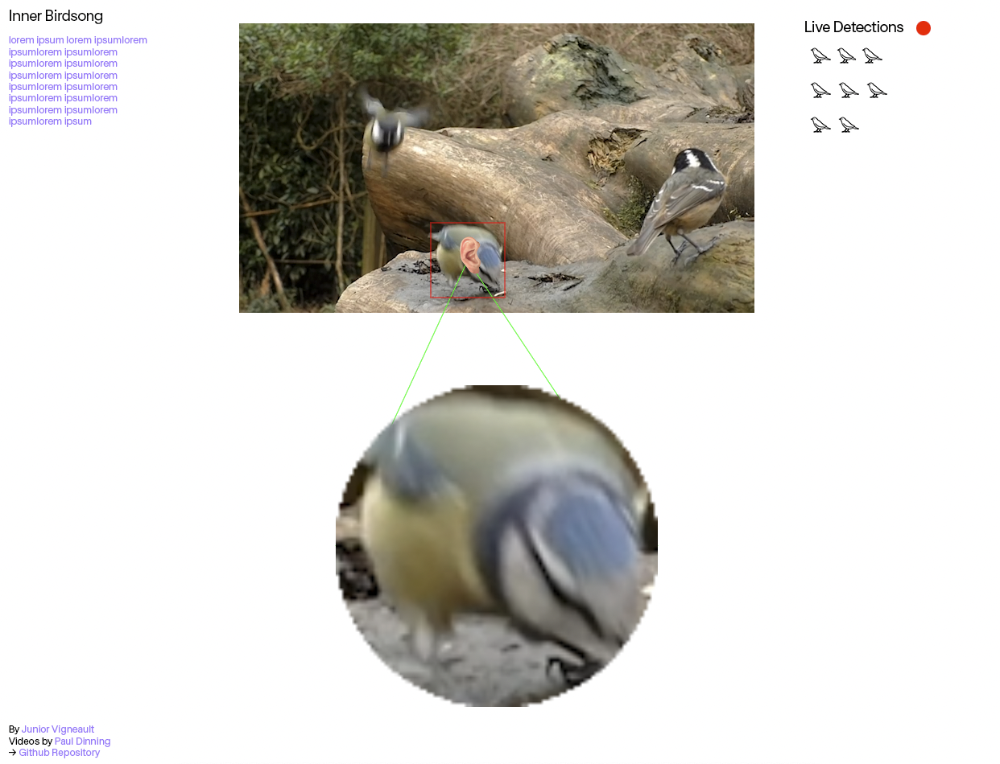

I tried adding the live detections as bird symbols, to show how many birds were currently detected (adding one/deleting one depending on the number of detections), because I wanted to add another layer of dynamic feeling, but it turned out really chaotic and decided to drop it for now, although I still like the idea. I did keep the Live Dections with recording flashing red dot to add a feeling of liveness to it.
I ended up with a final output that is very similar but with information and instructions (mouse press and hold) in an about section up top. So this is the final product I presented in class:

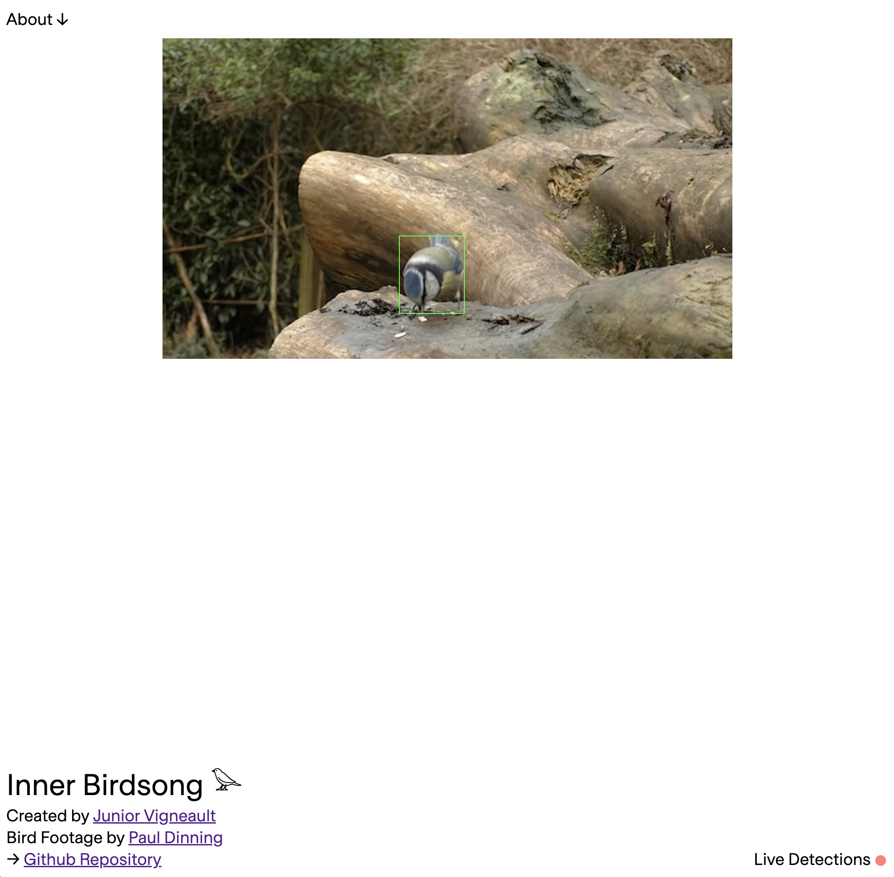
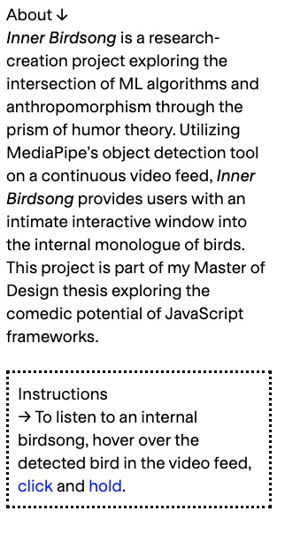

## March 29 2024 - AFTERNOON

I presented this work in front of some faculty and other students. I literally whipped my presentation in 20 minutes because I was debugging something until the last minute (classic). I think I did good, although I regret not having talked about the process much and more the finished thing (which was what was asked of us but made it seem like it was disconnected from its research purposes since my research is a lit about process?). 
I ended up getting a lot of laughs so it was good, like it was genuinly funny altough I wasn't too aprehensive about that, I had a really good feeling about that having shown it to other people before and also just because I was still laughing when interacting with it even after 1000000 times of trying it. 

Here are problems/things i want to change/fix before making it official:
- So sometimes the detection switches to another random bird when the previous one stops being detected, and this makes it a bit weird sometimes because the song continues playing. 
  - Potential solution: Still images or trying to slow down the video even more
- Sometimes there is just one bird, but the detection stops and song is still playing even though there are no birds at all
  - Solution: Add a conditionnal that when detections.length = 0, stop the song currently playing
- So right now I have like 12 videos of 5 minutes, some are reppetitive and are very similar. I kinda want more diversity because it keeps the whole thing interesting, but I want to figure out a way were it is efficient in terms of performances, like i dont want to load a lot of videos when the user arrives on the page. I also want the videos to be free of rights and fitting with the project. 
  - Potential solution: find an online library of perfect bird videos and load them randomly when one detection is done? 
- **Ok so this is a big one**: I'm thinking of MAYBE completely letting go of birds? I think this could be a good point to maybe take a step back and see if the framework i designed would be more interesting with other source materials. I had this idea because sometimes the object detection thinks for some reason that a pile of rocks is at least 20% a bird (the filter i programmed), and so you can click on the rocks and it becomes funny to see how innanimate rocks also have a vibe. But I think this is only funny when its supposed to be birds but then a rock happens for some reason? Again, bugs are funny apparently. I think having it completely random is maybe too much, having a sort of category is nice, but maybe birds is too precise and limits the comedic potential in a way. It also is too rigid as a set of rules and makes the errors of mediapipe funny sometimes but not all the time? Theres really something interesting about the point of rigidity of rules to encourage bugs so that its *always* funny even when it doesn't work? I mean I feel like its working here with birds but I'm just wondering if it could be a bit larger in concept. Say animals for example. This could give me more video material to work with and would make it more interesting in terms of diversity of reactions. Like when you check the vibe of a small bird and then it switches to the swan for example, its funny cause they really all are different visually and carry their own stereotypical essence that is interesting to subvert with sound. Like its funny when you click on the small bird and its a fast techno sound and then its a swan (regal, pure, big, beautiful) and the sound is emo scream music. If the birds are too similar the contrast sound and appearance of the bird gets too common quick, like there needs to be a vast amount of type of sounds and a vast amount of appearances so that it stays interesting. if its only one or the other then it becomes predictable even if funny for a couple of times. The goal is not to make it eternally funny but its nice if it is a bit more than a one liner and more exploratory. So yeah, test with other types of footage. Look for online streaming libraries? 
- Also, to continue on that. I was reading about the term VIBE CHECK, and I think it's really comedic and actually what I'm doing. Definition from Later.com : "Vibe check" is a phrase used on social media to inquire about or assess the general atmosphere or mood of a person, group, or situation. It's a lighthearted way of checking in on someone's emotional state or evaluating the overall energy or "vibes" in a particular context. So yeah I think I might want to create a tool to check the vibe?? Its more fun than "internal dialogue" i feel like. Vibe check machine... Yeah its more interesting. definition continued: The concept of "vibe check" often carries an undertone of wanting to ensure that everyone is feeling good or that the atmosphere is positive and harmonious. It's a way to foster connection, express concern, or simply engage in a playful and casual manner within online interactions [Later.com](https://later.com/social-media-glossary/vibe-check/#:~:text=%22Vibe%20check%22%20is%20a%20phrase,vibes%22%20in%20a%20particular%20context.). Theres also this thing were you can pass or fail a vibe check which could be interesting to incorporate as an extra layer of comedy and gamification. [cambridge dictionnary](https://dictionary.cambridge.org/dictionary/english/vibe-check): People dating on the internet are increasingly turning to a pre-date vibe check. Could be hilarious to use actual real people? Like video footage from shutterstock or something. vibe check machine... hmmmmmmm.. HM. Would be really different though. fuck should i make this? Dunno. Should ask pippin. 
My suggestion is that you don’t start by saying, “How are you?” to your friends; go, instead, with “Vibe check?”
[vibes from guardian](https://www.theguardian.com/lifeandstyle/2023/mar/22/vibes-definition-slang-language-meaning)
Also : Failing a Vibe Check usually means that someone is seen as having a negative or off-putting energy or mood. However, the consequences or implications of failing a Vibe Check can vary. It might lead to jokingly being excluded from a group activity or serve as a lighthearted way to draw attention to someone’s actions or behavior. Vibe is off????? What does Vibe Is Off mean?
Vibe is off is a slang phrase used to convey a negative feeling or suspicion regarding someone, something, or a situation. It means that the atmosphere, energy, or mood around a person, place, or situation feels uncomfortable, strange, or not fitting. [source](https://keyhole.co/social-media-glossary/vibe-check/) also: [vibe check meme origin] (https://happymag.tv/vibe-check-meme-explained/)

Last little things I wanna fix :
- General design of the page - Instructions not really clear, make them more part of the work, like pointer pointer (instructions are written and change depending on the action)
- Trash p5 and only work with vanilla js - Reeallllly slows everything down
- Sounds.... Test more options, test what is funny what isnt, make a strong and vast selection. Make sounds not heavy. 

## May 2nd 2024 - NOON

I think this project needs a last phase to make it ready for release and a strong case for my thesis. I want this all done before I leave for Island. Here is a very general to do list for that to happen:

- Test different kinds of videos 
- Brainstorm different avenues for more complex interface
- Find out a way to store videos elsewhere? Figure out what to do with video stuff.
- Make sound humour test - reflect and choose a specific niche maybe. Download and refine sound library
- Get rid of P5: have the same thing but working with vanilla js only. Way too slow right now.
- Find a way to put online
- Publish it